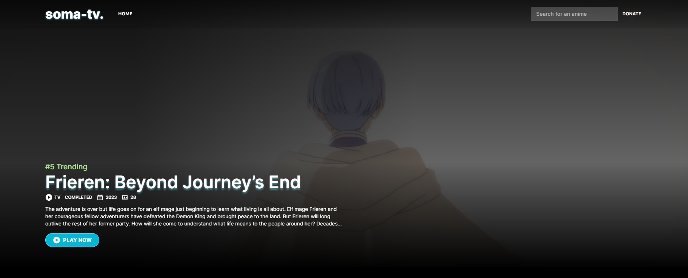

Watch and stream your favourite anime, ad free.

Soma Version 2.0 is the latest iteration of my previous anime website, [**Soma Version 1.0 (soma-chill)**](https://github.com/jasondev01/soma). It is a free, open-source anime streaming website built using [Next.js 14](https://nextjs.org/) and [Tailwind](https://tailwindcss.com/).


## Features

- **No Ads** - No ads, no popups, no redirects.
- **PWA Support** - You can install it on your phone for an easy access.
- **Disqus Comment** - You can interact with the other users on the anime episode you watch.
- **Skip Intro** - Newly added feature that let's you skip the anime opening if it exists on the api source.

## Local Development

```
git clone https://github.com/jasondev01/soma-v2.0.git
cd soma-v2.0
npm install or yarn install
```

Before running the application, ensure that you rename the `.env.sample` file to `.env`. For `EXTERNAL_API` and `VIDEO_API` please refer to anify and kavin rocks api documentation.

```
npm run dev or yarn dev
```

## Deployment

Soma is built on Next.js 14, so caching is done on the fly and will revalidate the data at given intervals. You can refer to `utils/get-anime.ts` for more details. However, if you want to integrate third-party caching, you can do so on your own. I suggest using KV on Vercel for caching.

[](https://vercel.com/new/clone?repository-url=https%3A%2F%2Fgithub.com%2Fjasondev01%2Fsoma-v2.0)

If you are deploying to vercel. Make sure to set ENVIRONMENT VARIABLE `EXTERNAL_API`.

## Credits

[Consumet](https://github.com/consumet/consumet.ts) [Anify](https://github.com/Eltik/Anify)


## Disclaimer

This is a personal project intended for educational reference and/or purposes. The project is open-source and licensed under the MIT.

## Note

You no longer need `TMDB API KEY` as of April 04, 2024. Also this project is currently in development and will prolly add more features to it. If you are interested in seeing the further versions of this project, feel free to fork the repository itself or visit this repo at your leisure.

## Support

<a href="https://www.buymeacoffee.com/somae">
    
</a>  